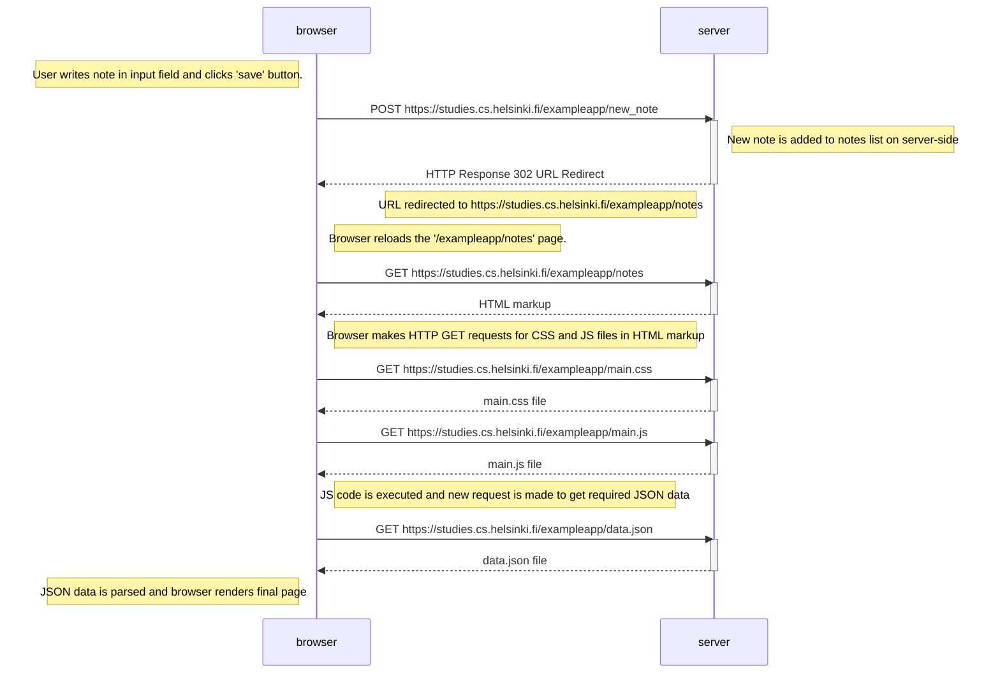

```mermaid
sequenceDiagram
	participant browser
	participant server

	Note left of browser: User writes note in input field and clicks 'save' button.

	browser ->> server: POST https://studies.cs.helsinki.fi/exampleapp/new_note
	activate server
	Note right of server: New note is added to notes list on server-side
	server -->> browser: HTTP Response 302 URL Redirect
	deactivate server

	Note left of server: URL redirected to https://studies.cs.helsinki.fi/exampleapp/notes

	Note right of browser: Browser reloads the '/exampleapp/notes' page.

	browser ->> server: GET https://studies.cs.helsinki.fi/exampleapp/notes
	activate server
	server -->> browser: HTML markup
	deactivate server

	Note right of browser: Browser makes HTTP GET requests for CSS and JS files in HTML markup

	browser ->> server: GET https://studies.cs.helsinki.fi/exampleapp/main.css
	activate server
	server -->> browser: main.css file
	deactivate server

	browser ->> server: GET https://studies.cs.helsinki.fi/exampleapp/main.js
	activate server
	server -->> browser: main.js file
	deactivate server

	Note right of browser: JS code is executed and new request is made to get required JSON data

	browser ->> server: GET https://studies.cs.helsinki.fi/exampleapp/data.json
	activate server
	server -->> browser: data.json file
	deactivate server

	Note left of browser: JSON data is parsed and browser renders final page

```
