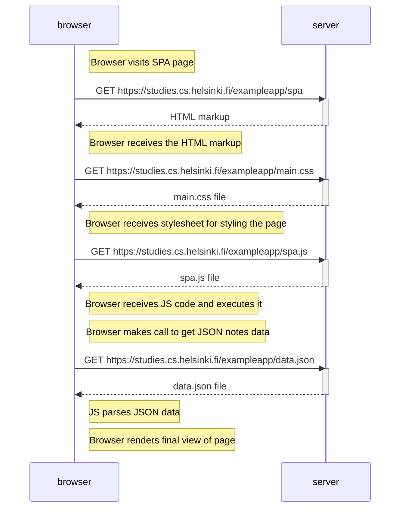

```mermaid
sequenceDiagram
	participant browser
	participant server

	Note right of browser: Browser visits SPA page

	browser ->> server: GET https://studies.cs.helsinki.fi/exampleapp/spa
	activate server
	server -->> browser: HTML markup
	deactivate server

	Note right of browser: Browser receives the HTML markup

	browser ->> server: GET https://studies.cs.helsinki.fi/exampleapp/main.css
	activate server
	server -->> browser: main.css file
	deactivate server

	Note right of browser: Browser receives stylesheet for styling the page

	browser ->> server: GET https://studies.cs.helsinki.fi/exampleapp/spa.js
	activate server
	server -->> browser: spa.js file
	deactivate server

	Note right of browser: Browser receives JS code and executes it

	Note right of browser: Browser makes call to get JSON notes data

	browser ->> server: GET https://studies.cs.helsinki.fi/exampleapp/data.json
	activate server
	server -->> browser: data.json file
	deactivate server

	Note right of browser: JS parses JSON data

	Note right of browser: Browser renders final view of page

```
