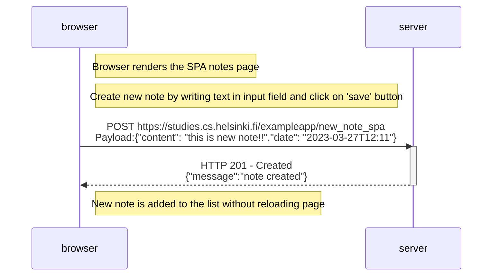

```mermaid
sequenceDiagram
	participant browser
	participant server

	Note right of browser: Browser renders the SPA notes page

	Note right of browser: Create new note by writing text in input field and click on 'save' button

	browser ->> server: POST https://studies.cs.helsinki.fi/exampleapp/new_note_spa<br/>Payload:{"content": "this is new note!!","date": "2023-03-27T12:11"}
	activate server
	server -->> browser: HTTP 201 - Created<br/>{"message":"note created"}
	deactivate server

	Note right of browser: New note is added to the list without reloading page
```
